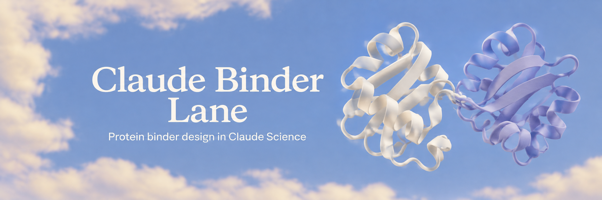
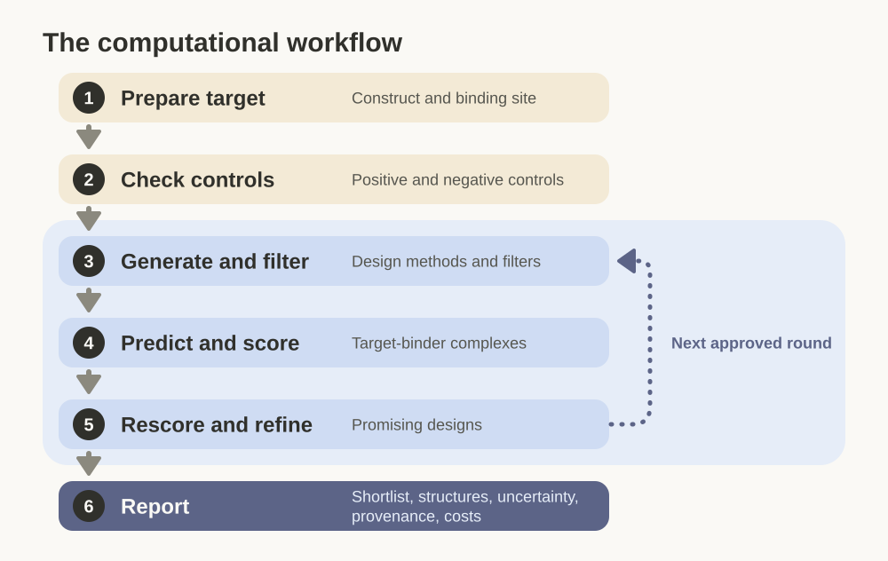
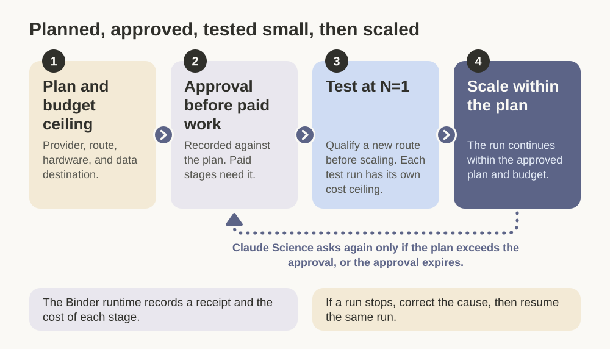
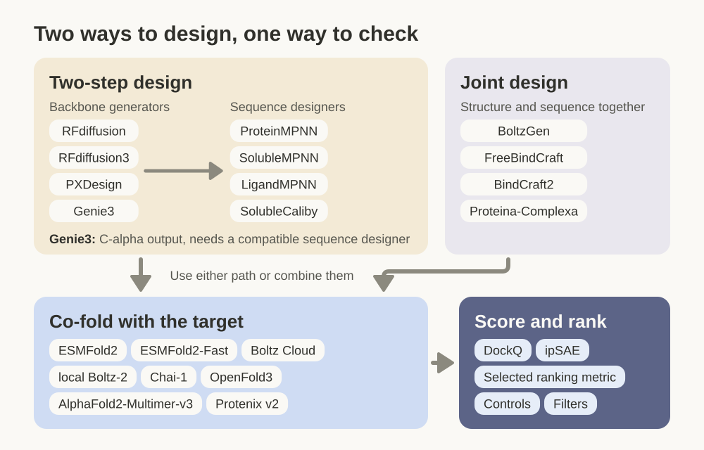

# Claude Binder Lane

Claude Binder Lane gives Claude Science a campaign workflow for computational
protein-binder design. A **binder** is a protein designed to attach to a target
protein. Name a target and a budget. Claude Science checks the construct and
site, discovers suitable tools and compute, proposes a plan, and runs it after
you approve the paid work. It returns ranked candidates, predicted structures,
controls, recorded costs, and an offline viewer.

The workflow is similar to the computational part of
[Anthropic's protein design study](https://www.anthropic.com/research/Claude-accelerates-protein-design).
It checks methods against positive and negative controls, generates and filters
candidates, predicts each candidate's complex with the target, scores it, and
refines the best designs over rounds. The catalogue includes **BindCraft2** and
the pinned accelerated **Boltz-2** and **ESMFold2** kits, alongside the broader
published stack. It also explains **BioIR**, NVIDIA's BioNeMo Inference Runtime,
as a GPU prediction route. The 32 shipped tools are a starting catalogue.
Claude Science can use tools connected to your session and add new tools with
campaign-local catalogue entries and connectors.

Every ranking is a model prediction. Keep its controls, prediction uncertainty,
and provenance (the parameters, inputs, score records, and output hashes behind
it) with it.

[Give this repo to Claude](#give-this-repo-to-claude) · [Tools and routes](#tools-and-routes) · [Guides](#guides)

## How a campaign works

The [published workflow mapping](skills/claude-binder-lane/references/published-workflow.md)
connects these stages to the study's protocol and to the commands in this skill.

The skill includes its own Python runtime. Claude Science calls it to validate
the plan, run each stage, and record the artifact hashes, receipts, and costs.

## Give this repo to Claude

Point your Claude or Claude Science agent at this repository and say:

> Install this repository's `claude-binder-lane` skill in my Claude Science
> organization, then use it to plan a binder campaign for **[target]** with a
> budget ceiling of **[amount]**. Check the target construct and design site,
> discover the tools and compute available in my session, and propose a route.
> Use a connected tool or add a new tool and connector when it fits the target.
> Include target-matched controls, fixed seeds, two independent prediction
> checks, and a ranking rule. Show me the provider, data destination, hardware,
> and estimated cost before paid work. Carry one design through a new handoff
> before scaling. Return a ranked computational shortlist, structures, control
> results, provenance, and the time and cost report. If I supply candidates,
> start with those.

Claude should locate your organization's skill directory, preserve an existing
installation, place this repository's `skills/claude-binder-lane` package there,
reload the skill catalogue, and start a fresh session with the new skill. The
package includes its Python runtime. You do not need to operate the repository
or run terminal commands yourself. The [small campaign fast
path](skills/claude-binder-lane/references/small-campaign-fast-path.md) tells
Claude which references to read and how to qualify one complete handoff before
scaling.

For a broader campaign or a close comparison with Anthropic's published study,
tell Claude the desired methods and claim. Claude Science can select the full
campaign workflow, inspect the relevant catalogue entries, and qualify each
selected handoff before scaling.

## Cost and control

No paid work starts before you approve a plan with a budget ceiling. Paid work
runs on your own account. Claude Science first sends one design (`N=1`) through
each new compute route and checks the output, then scales up within the
approved plan.

## Tools and routes

The [catalogue](skills/claude-binder-lane/references/tool-catalogue.md) describes
32 tools with their routes, input requirements, licence terms, and available
execution evidence. Claude Science can [add another tool](skills/claude-binder-lane/references/connector-authoring.md)
in your campaign workspace without editing the installed skill. A campaign can
use either design path or combine them.

| Stage | Choices |
| --- | --- |
| Generate backbones, then design sequences | RFdiffusion, RFdiffusion3, PXDesign, or Genie3, followed by a compatible sequence designer (Genie3 emits C-alpha backbones only) |
| Design structure and sequence together | BoltzGen, FreeBindCraft, BindCraft2, or Proteina-Complexa |
| Design sequences for a backbone | ProteinMPNN, SolubleMPNN, LigandMPNN, or SolubleCaliby |
| Co-fold candidates with the target | ESMFold2, ESMFold2-Fast, Boltz Cloud, local Boltz-2, BioIR with a supported model, Chai-1, OpenFold3, AlphaFold2-Multimer-v3, or Protenix v2 |
| Score and rank | DockQ, ipSAE, the selected ranking metric, controls, and filters |

The skill ships no adapter for Chai-1 or OpenFold3, and no profile binds local
Boltz-2. Claude Science can reach them through a platform skill or a registered
endpoint and pass the hashed artifacts to the next stage.

Use a faster option when it meets the stage's requirements. Keep a slower method
when it adds an independent check or supports a close comparison with the
published protocol. Record each substitution, because it can change the scores
and the ranking.

The plan also covers target preparation, controls, filtering, promotion to
rescoring, optimization rounds, and output checks. To start from candidates you
already have, follow the
[supplied-candidate workflow](skills/claude-binder-lane/references/running-a-campaign.md#start-with-supplied-candidates).

Each stage picks its own compute route:

| Route | What it needs |
| --- | --- |
| Modal | A connected workspace, environment, storage bindings, and an approved budget |
| fal | A deployment on your account, credentials, model pins, and an approved budget |
| RunPod | A Serverless endpoint with a qualified worker contract, or a direct workflow through the provider's own tools. The skill ships the client and no deployed endpoint or worker image |
| Lambda Cloud | The provider's own console, CLI, or API, or a Claude Science route. The skill ships no Lambda transport or worker image |
| Managed endpoint or NVIDIA BioNeMo NIM | A registered service and its model-specific request and output contract. Claude Science can call it and pass hashed artifacts on. Automated dispatch by this skill also needs an adapter, and the skill binds none |
| NVIDIA BioIR | A supported NVIDIA GPU host, the BioIR Python runtime, model weights, and the selected model's input contract |
| Local or SSH/HPC | The selected tool's runtime, inputs, and execution environment |

[Route status](skills/claude-binder-lane/references/current-status.md) lists which
routes have recorded runs. [Tool discovery](skills/claude-binder-lane/references/platform-tool-discovery.md)
shows which tools and routes your session can use. The catalogue's binding status
shows which tools this skill can run itself.

## Match or adapt the published study

To run your own study, ask Claude Science to configure a `small-run.template.json`
or `full-ensemble.template.json` profile for your target, tools, and scale. It
checks each tool's terms and input contract and continues within the approved
plan and budget. Report a customized campaign as an adaptation.

To compare closely with the published study, ask Claude Science to match the
published setup. `rfdiffusion3-two-arm.template.json` declares bindings for all
12 tools in the published roster. It composes once you set the five fal
deployment endpoints its commands reference. Claude Science compares your
target, site, revisions, seeds, settings, scale, controls, filters, rounds,
routes, and ranking with the protocol and records each difference. The
[comparison guide](skills/claude-binder-lane/references/published-campaign-comparison.md)
explains what a configured binding, a qualified run, and a reproduced result
each show.

The published protocol is Anthropic's
[multi-target binder design prompt](https://huggingface.co/datasets/Anthropic/claude-protein-binder-design/blob/d442eeb/prompts/prompts/multi_target_binder_design_prompt.md)
at commit `d442eeb`, with its
[technical report](https://www-cdn.anthropic.com/30bf50e22a01388bb29bf077ee3f244531594b7a.pdf).
The [target reference](skills/claude-binder-lane/references/published-targets.md)
lists the targets from the study that the skill transcribes. The
[dataset](https://huggingface.co/datasets/Anthropic/claude-protein-binder-design/tree/main)
is licensed CC BY 4.0, and material transcribed from it is attributed to
Anthropic under that licence. Anthropic also published work on
[biomolecular model acceleration](https://www.anthropic.com/research/claude-uplifts-biomolecular-modeling)
with its [code](https://github.com/anthropics/uplifting-biomolecular-modeling).

## Guides

| Task | Guide |
| --- | --- |
| Start a bounded campaign with Claude Science | [Small campaign fast path](skills/claude-binder-lane/references/small-campaign-fast-path.md) |
| Choose target, tools, budget, rounds, and ranking | [Nine decisions](skills/claude-binder-lane/references/the-nine-decisions.md) |
| Prepare structures, chains, and site residues | [Target inputs](skills/claude-binder-lane/references/target-inputs.md) |
| Compare tool and route choices | [Tool catalogue](skills/claude-binder-lane/references/tool-catalogue.md) |
| Estimate cost and authorize a run | [Measured costs](skills/claude-binder-lane/references/measured-costs.md) and [approval and spend](skills/claude-binder-lane/references/approval-and-spend.md) |
| Generate and filter candidates | [Design and filters](skills/claude-binder-lane/references/design-and-filters.md) |
| Build Anthropic's ESMFold2 optimization kit on Modal | [Pinned image recipe and qualification](skills/claude-binder-lane/references/esmfold2-kit-modal.md) |
| Use NVIDIA BioNeMo Inference Runtime for structure prediction | [BioIR route](skills/claude-binder-lane/references/bioir-route.md) |
| Try a target on selected providers | [New-target canary](skills/claude-binder-lane/references/new-target-provider-canary.md) |
| Read results and prepare figures | [Reading results](skills/claude-binder-lane/references/reading-results-in-claude-science.md) |
| Check recorded execution evidence | [Route status](skills/claude-binder-lane/references/current-status.md) |

## Optional installation check

A real campaign does not need this check. Run it when an installation or a local
execution path is in doubt.

Ask Claude Science to run the
[local diagnostic](skills/claude-binder-lane/references/free-run.md). It plans and
runs a small fixture campaign with local test tools. It needs no account, makes no
provider call, and produces no biological prediction.

Claude can check the repository files against `RELEASE-MANIFEST.json` and run
the offline planning smoke check when an installation is in doubt. The smoke
check can take a few minutes and submits no provider job.

## Licence

The skill is MIT licensed: see [LICENSE.txt](LICENSE.txt). The
[tool terms](skills/claude-binder-lane/references/tool-licences.md) describe the
licences of external software and models. Selecting a tool can require its own
installation, weights, licence, or provider account.
