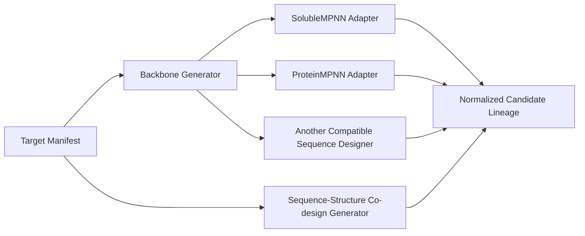

# Binder Lane Adapter Contract

An adapter gives one tool a stable place in the pipeline. The stage graph depends on adapter roles and normalized artifacts, not tool-specific directories or shell fragments.

## Adapter Fields

| Field | Content |
|---|---|
| `adapter_id` | Stable profile identifier |
| `role` | One registered pipeline role |
| `provider_facing` | Optional paid-route classification. Set `false` only when the adapter runs without a provider. |
| `capabilities` | Supported target, molecule, seed, and output features |
| `supported_entity_types` | Protein, RNA, DNA, ligand, and cofactor types accepted by a cofold predictor |
| `accepted_artifacts` | Normalized input artifact types |
| `produced_artifacts` | Normalized output artifact types |
| `source_revision` | Tool source commit or release |
| `model_revision` | Model or weight revision; use `none` when the adapter has no model |
| `environment_identity` | Container digest or environment-lock identity |
| `toolcheck_argv` | Read-only runtime probe |
| `command_argv_template` | Argument array for the adapter command |
| `parser_argv_template` | Argument array that validates and normalizes outputs |
| `parser_result_path_template` | Structured parser result inside the attempt directory |
| `environment` | Explicit non-secret environment values |
| `resources` | CPU, GPU, memory, image, lock, and weight requirements |

The executor passes argv arrays with `shell=False`. Compound command logic belongs in a reviewed adapter script. Model decisions select allowlisted adapter IDs and registered parameters; they do not create command text.

Materialization hashes selected package and bundle support files, executable JSON schemas, the smoke-to-scale helper, the stage-contract checker, and the lane runner. A run cannot start after one of those files changes.

## Registered Roles

| Role | Accepts | Produces |
|---|---|---|
| `target-preparer` | Target structures and site definitions | Target manifest and residue map |
| `runtime-validator` | Adapter and environment records | Runtime report |
| `control-builder` | Targets, controls, and registered predictor/scorer contracts | Raw control prediction manifest with the exact predictor × seed matrix |
| `backbone-generator` | Target manifest | Backbone candidate manifest |
| `codesign-generator` | Target manifest | Sequence-structure candidate manifest |
| `sequence-designer` | Backbone candidate manifest | Sequence candidate manifest |
| `candidate-normalizer` | Generator and sequence manifests | One lineage table |
| `sequence-filter` | Candidate lineage | Composition and duplicate results |
| `structure-filter` | Passing candidates | Novelty, likelihood, and structure results |
| `cofold-predictor` | Candidate set and target | Per-seed raw complex, PAE, and source manifest |
| `interface-scorer` | Raw prediction manifests and design poses | Hash-bound interface measurement table |
| `promotion-selector` | Screen measurements and controls | Promotion manifest |
| `optimizer` | Selected parents and a validated decision | Exact child manifest with decision and parent hashes |
| `ensemble-reducer` | Uniform predictor outputs | Complete observation table |
| `portfolio-selector` | Complete observations and thresholds | Ranked portfolio |
| `output-validator` | Receipts and selected outputs | Final validation record |

## Generator Branches



The lineage table records both `origin_generator` and `sequence_designer`. Generator quotas always use `origin_generator`. Every sequence-bearing adapter owns one single-record FASTA per candidate and records the canonical residue-string hash and length. Every pose-bearing adapter owns the design-pose file named by its manifest.

## Predictor Stack

Each predictor has one adapter record and three uses:

- the screen stage uses the registered screen seed;
- every optimization round predicts and measures each new child with the screen seed;
- the rescore stage uses every registered rescore seed.

The predictor parser emits a raw prediction record with the complex, PAE, metric-source paths and hashes. Those referenced files remain inside the predictor stage attempt and are rehashed with the stage receipt. A scorer emits normalized measurements that carry the raw record hash, and every numerical value must equal the hashed metric-source record. Terminal validation joins these records exactly. A predictor replacement must supply every required raw source, chain mapping, and model revision. A scorer replacement must supply the configured confidence, pose, site, geometry, and registered custom measurements with their implementation revisions.

The optimizer writes new receipt-owned FASTA and design-pose files for every child, including an unchanged sequence or pose when the registered operation permits one. The two filter adapters run again after each optimization round. Their combined passing manifest is the only candidate set accepted by the round predictors.

The control-builder adapter dispatches the same registered predictor and scorer contracts over each control. Its output must match the exact target × control × predictor × rescore-seed matrix, predictor revisions, chain identities, structure hashes, raw files, and metric sources. It cannot substitute an aggregate control score.

## Parser Result

Every parser writes a JSON object with:

```json
{
  "ok": true,
  "parsed_count": 50,
  "rejected_count": 0,
  "errors": [],
  "source_output_hashes": ["<sha256>"]
}
```

The executor requires nonnegative parser counts, zero rejected records, an empty error list, unique non-image source hashes, and exact agreement with the current attempt’s files. Byte-identical image outputs may repeat across distinct designs. It validates registered JSON schemas and publishes all stage outputs as one rollback-capable transaction. The stage passes after the tool command, canonical smoke-to-scale checks, exact record counts, parser checks, schemas, and hashes all pass.

## Swap Procedure

- Register the replacement adapter with a new `adapter_id`.
- Match the role’s accepted and produced artifact schemas.
- Pin the source, model, environment, and weight identities.
- Add the toolcheck, argv, parser, resource, seed, and capability fields.
- Run N=1 on the actual target through the replacement adapter.
- Validate its normalized output and actual record count.
- Update the stage’s `adapter_id`.
- Materialize a new run bundle. The adapter change produces a new run fingerprint.

The profile can keep both adapters enabled as parallel arms. Candidate lineage and predictor IDs preserve their separate contributions.
